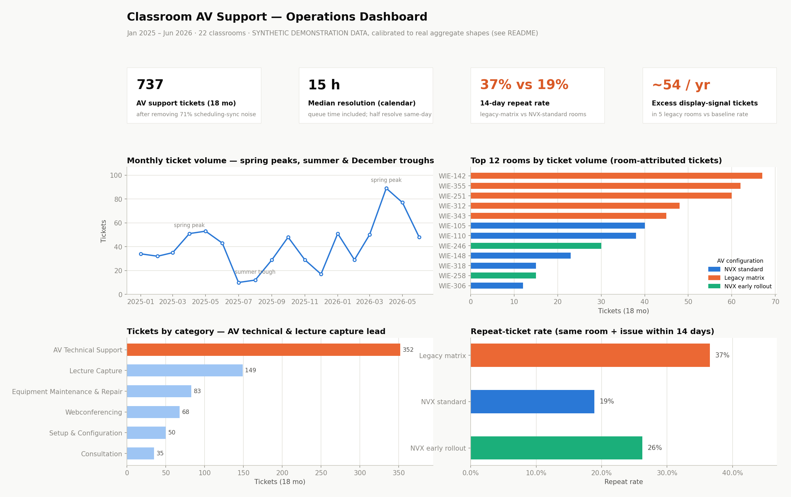
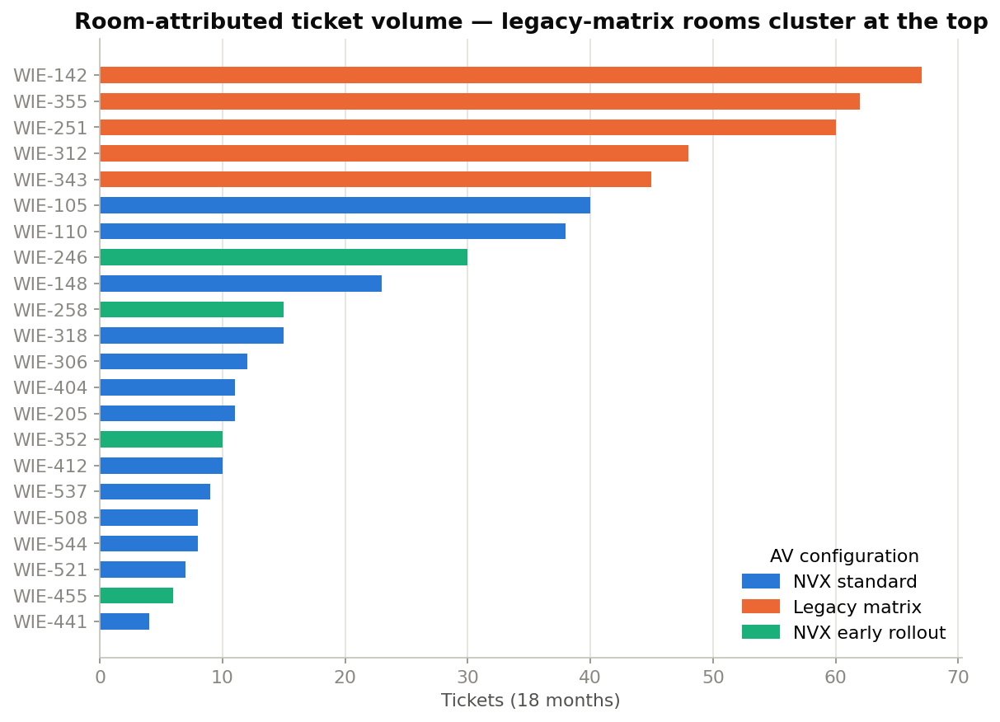
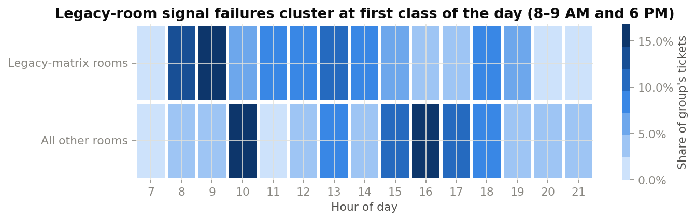
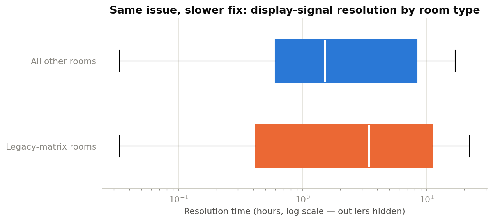
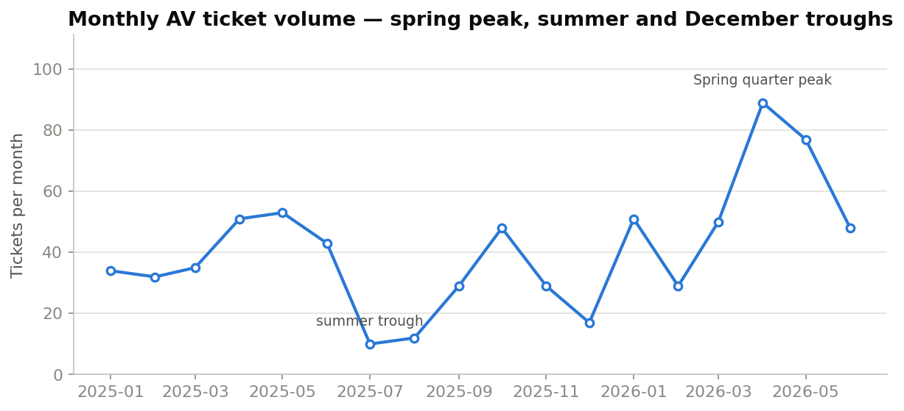

# Classroom AV Support Ticket Analysis

**Analyzing 18 months of ServiceNow-style AV support tickets across 22 classrooms to
identify recurring issue patterns, resolution-time trends, and the configuration root
cause behind a cluster of repeat support requests.**

> ⚠️ **All data in this repository is synthetic — and deliberately realistic.** This
> project recreates the ticket-trend analysis I performed on real ServiceNow data in a
> classroom AV support role. The real data is confidential and is not in this repo.
> Instead, [`scripts/generate_data.py`](scripts/generate_data.py) generates a dataset
> whose *aggregate statistical shape* — volume, seasonality, issue mix, resolution-time
> percentiles, data-quality quirks — was **calibrated against summary statistics from a
> real export** (see [Synthetic data methodology](#synthetic-data-methodology-full-transparency)).
> No real records, room numbers, names, or ticket text appear anywhere. Findings below
> are properties of the synthetic dataset, demonstrating the workflow end to end.

**➡️ [View the interactive dashboard in Looker Studio](https://lookerstudio.google.com/reporting/d73c802e-b650-4b93-8d8b-0593e27f0bd6)** — filterable by date, room, configuration, and category. Static preview:



## The question

A classroom AV support team was fielding recurring "no display" calls at class start
times, often from the same handful of rooms, often days after the "same" issue had
already been fixed. Anecdote said some rooms were cursed. The ticket data could say
something more useful:

1. What does the ticket queue actually consist of, once automation noise is removed?
2. Where does volume concentrate — by season, room, and issue type?
3. How long do tickets really take, and what drives the slow half?
4. Which rooms generate disproportionate *repeat* tickets, and what do they share?

## Key findings

### 0. First, the data had to be found inside the export

**~71% of the raw export wasn't support work at all** — it was incident rows filed
automatically by the 25Live room-scheduling integration. Any metric computed on the raw
file measures the booking calendar, not support demand. After filtering automation,
de-duplicating double-submissions, and normalizing room IDs and categories, 2,546 raw
rows became **737 human AV support tickets** — and a further **27% of those were missing
the room number**, which constrains every room-level metric (and produced its own process
recommendation: make the room field required on the request form).

### 1. Five rooms with one legacy AV configuration dominate the repeat-ticket problem

Joining tickets to the AV asset inventory showed the five busiest rooms all share a
2017-era configuration (`legacy_matrix_v1`): an HDMI matrix switcher with
**auto-input-switching disabled**, behind firmware two major versions old.

| Configuration | Rooms | Tickets/room (18 mo) | 14-day repeat rate |
|---|---|---|---|
| Legacy matrix (2017) | 5 | **56** | **37%** |
| NVX early rollout (2021) | 4 | 15 | 26% |
| NVX standard (2023) | 13 | 15 | 19% |



Utilization is a confounder — the legacy rooms are heavily taught. The evidence that
it's the *configuration* is what their tickets look like, not just how many there are:

- Display-signal issues (HDMI handshake + input switching) are **38% of their tickets
  vs 10% everywhere else** (χ² = 56.4, p ≪ 0.001)
- Those failures cluster at **8–9 AM and ~6 PM** — the first daytime class and the
  first evening-program class, i.e., the first cold-start handshake of each teaching
  block. That's an EDID negotiation failure signature, not random hardware faults
- **56% of legacy-room display-signal tickets recur within 14 days** — power-cycling
  fixes the morning, not the configuration



### 2. Overall resolution times mislead — the mix correction reverses the sign

Median resolution is **calendar time** (queue included): 15 hours overall, with 19%
resolved within the hour and a tail running to weeks. Compared naively, legacy rooms
look *faster* than standardized rooms — because their mix skews toward interrupt-driven
display fixes (median in hours) while standardized rooms carry more multi-day scheduled
work. Comparing **the same issue types**, legacy rooms take **more than twice as long**
(median 3.4 vs 1.5 hours). The naive aggregate had the sign of the effect backwards.



### 3. Demand is predictable — and growing

Volume peaks in the **spring quarter** with deep troughs in summer and December
(+32% year over year in this dataset), and arrives mid-day through the evening-program
hours, with real Saturday load. The preventative-maintenance windows are obvious and
currently unused: the quiet weeks directly before each demand peak.



## The recommendations

1. **Standardize the five legacy-matrix rooms** on the current NVX configuration
   (interim: enable auto-input-switching, update firmware, replace podium HDMI cabling).
2. **Add a cold-start display check to opening walk-throughs** for those rooms —
   verify handshake before the first morning class *and* before the evening block.
3. **Front-load preventative maintenance into the quiet weeks** (late December, late
   March) before each demand peak.
4. **Make the room field required** on the AV request form — 27% of tickets currently
   can't participate in room-level analysis.

**Estimated impact (on this dataset):** the legacy rooms' *excess* display-signal
tickets alone — a deliberately conservative frame — come to **~54 tickets/year, ~11% of
all human AV volume**, disproportionately the class-blocking morning kind, plus the
technician hours burned re-fixing the same five rooms.

## Repository structure

```
├── data/
│   ├── av_tickets.csv        # 2,546 synthetic raw rows (18 months, automation noise included)
│   └── classrooms.csv        # 22-room AV asset inventory (join table)
├── notebooks/
│   └── av_ticket_analysis.ipynb   # full analysis: cleaning → EDA → pattern → impact
├── scripts/
│   ├── generate_data.py      # synthetic data generator (documents every planted pattern)
│   ├── build_dashboard.py    # renders dashboard/dashboard.png
│   └── export_looker.py      # analysis-ready flat table for Looker Studio / Tableau
├── sql/
│   └── analysis_queries.sql  # warehouse-style SQL mirroring the pandas analysis
├── dashboard/
│   ├── dashboard.png         # static export of the reporting dashboard
│   ├── looker/               # cleaned flat table to feed Looker Studio
│   └── figures/              # individual charts used above
├── interview-prep/
│   └── INTERVIEW_PREP.md     # methodology & walkthrough notes
└── requirements.txt
```

## Synthetic data methodology (full transparency)

The generator was built in two passes:

1. **Structure:** rooms with equipment loadouts and configuration variants, a
   14-type issue catalog with realistic descriptions, an academic-calendar seasonality
   model, technician assignment, and injected data-quality problems (automation rows,
   missing room numbers, open tickets, casing/whitespace inconsistencies, duplicate
   submissions).
2. **Calibration:** the distributions were then tuned to match **aggregate summary
   statistics measured from a real ServiceNow export** that stays outside this repo
   (in a gitignored private folder). Calibrated dimensions: annual volume (~450
   human AV tickets/yr), the ~3:1 automation-to-human ratio, monthly seasonality
   shape, weekday and hour-of-day profiles (including the evening-program tail),
   issue-category mix (lecture capture as the largest single bucket), calendar-time
   resolution percentiles (wide: ~20% within the hour, ~45% over a day), the ~30%
   missing-room rate, open-ticket rate, technician concentration, and the ~30%
   baseline 14-day repeat rate — reproduced via recurrence chains, where an
   unresolved root cause spawns follow-up tickets.

  Only summary statistics crossed the boundary — no rows, identifiers, or text. Room
  numbers, names, and course titles are fictional.

The one thing *not* calibrated is the headline pattern itself: the real export carries
no AV-configuration data, so the legacy-config effect (its 2.9× issue-rate multiplier,
slower like-for-like fixes, elevated recurrence) is **planted** at magnitudes consistent
with the calibrated environment. This project therefore demonstrates *method*, not
discovery: validate the join, filter the noise, compare like-for-like, test the
association, size the impact, state the limitations (see the notebook's final section).

Regenerate everything with a fixed seed:

```bash
python -m venv .venv && source .venv/bin/activate
pip install -r requirements.txt
python scripts/generate_data.py          # regenerate data/ (seed 42)
jupyter nbconvert --to notebook --execute --inplace notebooks/av_ticket_analysis.ipynb
python scripts/build_dashboard.py        # regenerate dashboard/dashboard.png
```

## Tech stack

- **Python** — pandas, NumPy for the analysis pipeline; SciPy for the chi-square test
- **matplotlib / seaborn** — all visualizations, on a colorblind-safe palette
- **SQL** — warehouse-style companion queries (window functions, joins), validated on SQLite
- **Jupyter** — narrative analysis notebook
- **Looker Studio** — [interactive dashboard](https://lookerstudio.google.com/reporting/d73c802e-b650-4b93-8d8b-0593e27f0bd6)
  built from the cleaned export in `dashboard/looker/` (static preview above)
